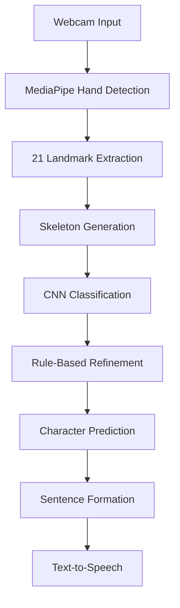

# ✋ Advanced Hand Sign Recognition System

> Real-time gesture-to-speech communication using computer vision and
> deep learning.


------------------------------------------------------------------------

# Table of Contents

1.  Overview
2.  Motivation
3.  Project Highlights
4.  Key Features
5.  System Workflow
6.  Dataset & Preprocessing
7.  Model Architecture
8.  Tech Stack
9.  My Contributions
10. Folder Structure
11. Requirements
12. Setup & Execution
13. Output
14. Current Limitations
15. Future Improvements
16. Skills Demonstrated
17. Contributors
18. License
19. Conclusion

------------------------------------------------------------------------

# 1. Overview

The **Advanced Hand Sign Recognition System** is a real-time computer vision application that translates hand sign gestures into text and speech.

Using a webcam, the system detects a user's hand, extracts 21 hand landmarks using MediaPipe, generates a skeleton representation, and classifies the gesture using a Convolutional Neural Network (CNN). The predicted characters are combined into meaningful sentences, converted to speech, and can be saved as conversation logs.

The project demonstrates the integration of **Computer Vision**, **Deep Learning**, and **Human--Computer Interaction** to improve accessibility for hearing- and speech-impaired individuals.

------------------------------------------------------------------------

# 2. 🎯 Motivation

Communication between sign language users and people unfamiliar with
sign language can often be challenging. This project aims to bridge that
gap by providing an AI-powered system capable of recognizing hand
gestures in real time and translating them into readable text and spoken
audio.

------------------------------------------------------------------------

## 🎬 Demo Video

[](https://youtu.be/PCtEu82GTNg)

------------------------------------------------------------------------

# 3. ⭐ Project Highlights

-   Real-time webcam-based gesture recognition
-   21-point hand landmark extraction
-   Skeleton-based preprocessing
-   CNN-based gesture classification
-   Rule-based prediction refinement
-   Sentence formation
-   Word prediction
-   Text-to-Speech conversion
-   Conversation export

------------------------------------------------------------------------

# 4. Key Features

-   🎥 Real-time hand gesture recognition
-   🧠 CNN-based gesture classification
-   🖐️ 21-point hand landmark detection
-   🧾 Sentence formation
-   🔤 Word prediction
-   🔊 Text-to-Speech output
-   💾 Save conversation feature

------------------------------------------------------------------------

# 5. System Workflow



------------------------------------------------------------------------

# 6. Dataset & Preprocessing

## Dataset

-   A--Z alphabet dataset
-   Organized class-wise
-   Preprocessed skeleton dataset included in `AtoZ_3.1`

## Preprocessing Pipeline

1.  Detect hand using MediaPipe
2.  Extract 21 landmarks
3.  Crop hand region
4.  Draw landmarks on a white canvas
5.  Save skeleton images class-wise

### Why Skeleton Images?

-   Removes background noise
-   Robust to lighting variations
-   Better generalization
-   Reduced overfitting

The repository includes the preprocessed dataset and a trained model for
direct inference.

------------------------------------------------------------------------

# 7. Model Architecture

**Model:** CNN

**Input Size:** 400 × 400

Architecture

    Conv2D
    ↓
    ReLU
    ↓
    MaxPooling
    ↓
    Conv2D
    ↓
    MaxPooling
    ↓
    Conv2D
    ↓
    MaxPooling
    ↓
    Flatten
    ↓
    Dense
    ↓
    Dropout
    ↓
    Softmax

Training uses grouped classification followed by rule-based refinement.

Included model:

`cnn8grps_rad1_model.h5`

------------------------------------------------------------------------

# 8. Tech Stack

  Technology           Purpose
  -------------------- ---------------------
  Python               Core development
  OpenCV               Image processing
  MediaPipe (cvzone)   Hand tracking
  TensorFlow / Keras   Deep Learning
  NumPy                Numerical Computing
  pyttsx3              Text-to-Speech

------------------------------------------------------------------------

# 9. 👨‍💻 My Contributions

-   Developed the real-time gesture recognition pipeline.
-   Integrated MediaPipe hand landmark detection.
-   Built the skeleton image preprocessing pipeline.
-   Integrated CNN-based gesture classification.
-   Implemented sentence formation and Text-to-Speech.
-   Improved project documentation and organization.

------------------------------------------------------------------------

# 10. Folder Structure

``` text
SIGN-LANGUAGE-PROJECT/
│
├── AtoZ_3.1/
├── assets/
├── cnn8grps_rad1_model.h5
├── final_prediction.py
├── conversation_*.txt
├── white.jpg
├── requirements.txt
└── README.md
```

------------------------------------------------------------------------

# 11. Requirements

-   Python 3.8+
-   Webcam
-   TensorFlow
-   OpenCV
-   MediaPipe / cvzone
-   NumPy
-   pyttsx3

------------------------------------------------------------------------

# 12. Setup & Execution

### Create Virtual Environment

``` bash
python -m venv venv
```

Windows

``` bash
venv\Scripts\activate
```

Linux/macOS

``` bash
source venv/bin/activate
```

### Install Dependencies

``` bash
pip install -r requirements.txt
```

### Run

``` bash
python final_prediction.py
```

------------------------------------------------------------------------

# 13. Output

The application provides:

-   Live hand skeleton visualization
-   Predicted character
-   Sentence formation
-   Word prediction
-   Text-to-Speech output
-   Conversation export

### Screenshots

``` text
assets/live_detection.png
assets/gesture_output.png
assets/sentence_prediction.png
assets/conversation_log.png
```

------------------------------------------------------------------------

# 14. ⚠️ Current Limitations

-   Static ASL alphabet recognition only
-   Single-hand gestures
-   Webcam required
-   Performance depends on hand visibility and lighting

------------------------------------------------------------------------

# 15. Future Improvements

-   LSTM-based dynamic gesture recognition
-   Transformer models
-   Android/iOS deployment
-   Multi-language support
-   Two-hand gesture recognition

------------------------------------------------------------------------

# 16. 🛠 Skills Demonstrated

-   Computer Vision
-   Deep Learning
-   CNN
-   OpenCV
-   TensorFlow
-   MediaPipe
-   Image Processing
-   Python
-   Human-Computer Interaction

------------------------------------------------------------------------

# 17. Contributors

  Name           GitHub
  -------------- --------------------------------------------------------
  Aditya Singh    [@Aditya2608-byte](https://github.com/Aditya2608-byte)
  Ishant Shekhar  [@ishant212](https://github.com/ishant212)
  Aditi Arya      [@Aditea19](https://github.com/Aditea19)

------------------------------------------------------------------------

# 18. License

This project is licensed under the MIT License.

------------------------------------------------------------------------

# 19. Conclusion

This project demonstrates how modern computer vision and deep learning
techniques can be combined to build an assistive technology application
capable of translating sign language into text and speech in real time.

It highlights practical experience in AI, machine learning, image
processing, and human-computer interaction, making it a strong portfolio
project for software engineering, AI/ML, and computer vision roles.

⭐ If you found this project useful, consider starring the repository.
