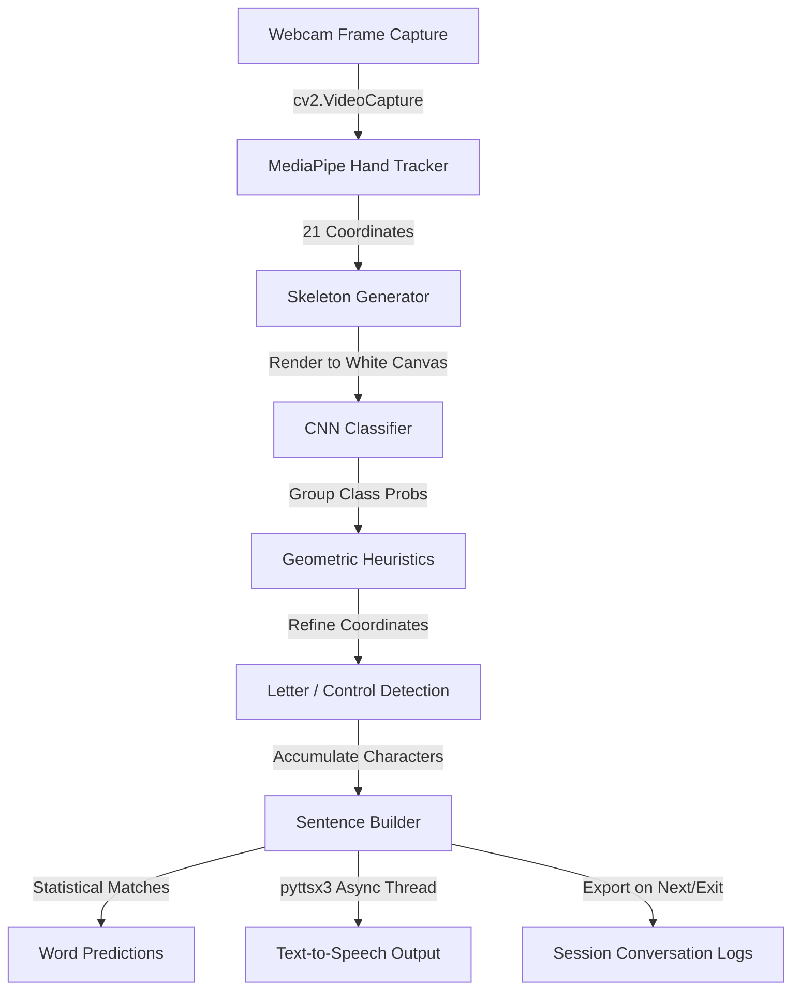
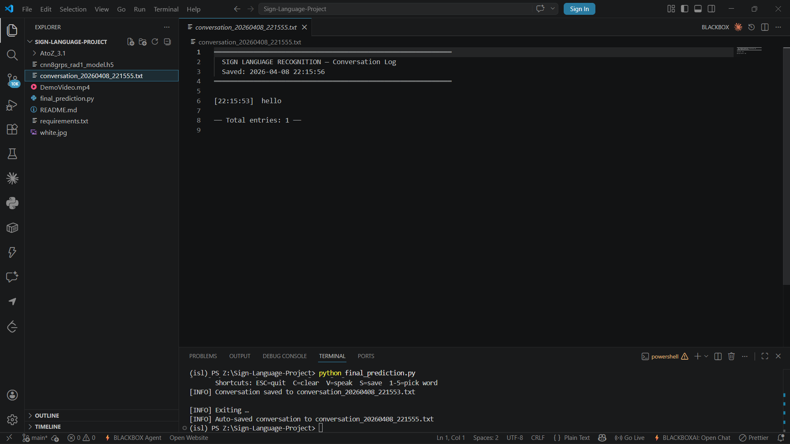

# ✋ Enhanced Sign Language Recognition System v2.0

[](https://www.python.org/)
[](https://www.tensorflow.org/)
[](https://github.com/google/mediapipe)
[](https://opencv.org/)

An advanced, real-time computer vision and deep learning application that translates hand gestures into text and speech. Designed with a custom split-panel dark-mode user interface, it provides text-to-speech feedback, statistical word completions, and session conversation logging to bridge the communication gap for hearing- and speech-impaired individuals.

---

## 📖 Table of Contents
1. [System Overview](#-system-overview)
2. [Key Features](#-key-features)
3. [UI Design & Architecture](#-ui-design--architecture)
4. [Landmarks & Skeleton Pipeline](#-landmarks--skeleton-pipeline)
5. [CNN & Heuristic Classification](#-cnn--heuristic-classification)
6. [Tech Stack](#-tech-stack)
7. [Installation & Setup](#-installation--setup)
8. [Keyboard Shortcuts](#-keyboard-shortcuts)
9. [Interface Gallery](#-interface-gallery)
10. [Future Scope](#-future-scope)
11. [Contributors](#-contributors)
12. [License](#-license)

---

## 🔍 System Overview

The **Enhanced Sign Language Recognition System** captures live video from a webcam, isolates hand landmarks, generates normalized skeleton images, and runs a dual-stage classification pipeline:
1. **Deep Learning Stage**: A Convolutional Neural Network (CNN) classifies the skeleton pattern into sub-groups.
2. **Geometric Heuristic Stage**: Rule-based logic calculates landmark distances and angles to refine predictions into precise alphabetical characters or special control actions (Space, Backspace, Next).

The output characters compile dynamically into sentences, aided by an auto-complete engine and a multi-threaded Text-to-Speech (TTS) synthesizer.



---

## ✨ Key Features

*   **Real-Time Skeleton Preprocessing**: Extracts 21 hand landmarks and renders them onto a 400x400 blank canvas, eliminating skin-tone, background, and lighting bias.
*   **Dual-Stage Classifier**: Combines CNN predictions with math-based finger heuristics to distinguish tricky alphabetical overlaps (e.g., separating `U` vs. `V` or `A` vs. `E`).
*   **Split-Panel Dark-Mode UI**: A sleek, custom BGR OpenCV layout split into a live camera viewport and a diagnostic sidebar cards interface.
*   **Next-Word Autocomplete**: Analyzes typed character prefixes and suggests the top 5 most probable word completions dynamically mapped to numeric keys `1-5`.
*   **Multi-threaded TTS engine**: Plays audio voiceovers asynchronously using a thread queue preventing main loop freezing.
*   **Conversation Logs Export**: Saves conversational histories to neatly formatted timestamped text files.

---

## 🎨 UI Design & Architecture

The application runs a unified, modern interface (1060x700 pixels) consisting of:

```
┌───────────────────────────────────────┬───────────────────────────────────────┐
│              LEFT PANEL               │              RIGHT PANEL              │
│             (Live Feed)               │         (Telemetry & Control)         │
│                                       │                                       │
│  [Live Feed Badge Overlay]            │  [Title Card]                         │
│                                       │  [Hold Progress Bar: 0 - 100%]        │
│  ┌─────────────────────────────────┐  │  [Detected Gesture Badge]             │
│  │                                 │  │  [Constructed Sentence Card]          │
│  │                                 │  │  [Word Predictions Slots 1-5]         │
│  │                                 │  │  [Status Alert Panel]                 │
│  │                                 │  │  [Shortcuts Panel]                    │
│  └─────────────────────────────────┘  │  [Gesture Legend Footer]              │
└───────────────────────────────────────┴───────────────────────────────────────┘
```

- **Live Feed Panel (Left)**: Renders the webcam stream overlaid with real-time hand bounding boxes and the active letter badge.
- **Telemetry Panel (Right)**: Contains the interactive modules styled in a clean dark-gray theme (`C_PANEL` = `(28,28,36)`) with subtle green and gold highlights.

---

## 🖐️ Landmarks & Skeleton Pipeline

Direct pixel classification from camera crops often suffers from overfitting due to dynamic backgrounds and lighting. This system implements a robust **Landmark-to-Skeleton mapping** process:

1. **Detection**: MediaPipe tracks the hand and returns 21 3D coordinates.
2. **Normalization**: Hand bounding boxes are padded by an offset (29 pixels) and cropped.
3. **Skeleton Rendering**: Coordinate lists are transformed and drawn onto a blank white matrix.
   - **Bones**: Drawn in green (`(0,255,0)`) connecting relevant joints.
   - **Joints**: Drawn as red circle nodes (`(0,0,255)`).
4. **Classification Feed**: The 400x400 skeleton image is fed to the model instead of raw skin pixels, making it highly robust.

| 21 Keypoint Mapping | Sample Skeleton Canvas |
| :---: | :---: |
|  |  |

---

## 🧠 CNN & Heuristic Classification

The model `cnn8grps_rad1_model.h5` acts as a macro-classifier, mapping the skeletons into groups. The final prediction is resolved in `classify_gesture()` using specific Euclidean distance formulas:

$$d(p_1, p_2) = \sqrt{(x_1 - x_2)^2 + (y_1 - y_2)^2}$$

### Heuristic Correction Rules
*   **Separating `C` & `O`**: Distinguishes them by checking the distance between the Middle Finger Tip (12) and Thumb Tip (4).
*   **Separating `U` & `V`**: Measures distance delta between index and middle finger tips to calculate scissor spread.
*   **Control Gestures**:
    - **Space**: Index (8) and Pinky (20) extended, Ring (16) and Middle (12) closed.
    - **Backspace**: Fist facing left/away with the thumb pointing up.
    - **Next (Commit)**: Thumb crossed horizontal across palm.

---

## 💻 Tech Stack

- **Python**: Core programming language.
- **TensorFlow / Keras**: CNN inference execution.
- **MediaPipe & cvzone**: Coordinates mapping.
- **OpenCV**: Image transformations, webcam, and custom rendering.
- **pyttsx3**: Cross-platform Text-To-Speech engine.
- **NumPy**: Linear algebra and image arrays.

---

## 🚀 Installation & Setup

### Prerequisites
- Python 3.8 to 3.11 installed.
- A functional webcam.

### 1. Clone the repository and navigate to folder
```bash
cd "Hand Sign Recognition System"
```

### 2. Create and Activate Virtual Environment
```bash
# Create Environment
python -m venv venv

# Activate Environment (Windows)
venv\Scripts\activate

# Activate Environment (Linux/macOS)
source venv/bin/activate
```

### 3. Install Dependencies
```bash
pip install -r requirements.txt
```

### 4. Run the Application
Ensure `cnn8grps_rad1_model.h5` is in the root directory.
```bash
python final_prediction.py
```

---

## ⌨️ Keyboard Shortcuts

Customize your workflow during runtime using these hotkeys:

| Key | Description |
| :---: | :--- |
| **`ESC`** | Gracefully terminate webcam streams and exit application. |
| **`C`** | Clear the current sentence. |
| **`V`** | Speak the active sentence aloud (Text-to-Speech). |
| **`S`** | Manually save conversation log to a `.txt` file. |
| **`1` - `5`** | Inject word prediction candidate from slot 1 through 5. |

---

## 🖼️ Interface Gallery

Here is the application interface running in real-time:

### 1. Live Feed & Landmark Tracking
The tracking engine bounding hand landmarks and plotting joint nodes.


### 2. Live Skeleton Output
Normalized skeletal structure rendered independently onto the white canvas for CNN inference.


### 3. Split-Panel Interface & Sentence Prediction
Full split window showcasing live character predictions, active hold meters, and predictive suggestions.


### 4. Saved Conversation Logs
Formatted conversation outputs saved locally with precise timestamp records.


---

## 🔮 Future Scope

- **LSTMs for Dynamic Signs**: Expanding static letter models to interpret dynamic words and sentences.
- **Web-Based Frameworks**: Porting Python OpenCV components to React/TypeScript using TensorFlow.js for accessibility.
- **Enhanced Vocabulary**: Integration of advanced LLM APIs for spelling correction and sentence refinement.

---

## 👥 Contributors

| Name | GitHub Profile | Role |
| :--- | :--- | :--- |
| **Aditya Singh** | [@Aditya2608-byte](https://github.com/Aditya2608-byte) | ML Pipelines & Gesture Mapping |
| **Ishant Shekhar** | [@ishant212](https://github.com/ishant212) | CNN Training & Landmarks Dataset |
| **Aditi Arya** | [@Aditea19](https://github.com/Aditea19) | Custom OpenCV UI, TTS & Integration |

---

## 📄 License

This project is licensed under the MIT License - see the [LICENSE](LICENSE) file for details.
