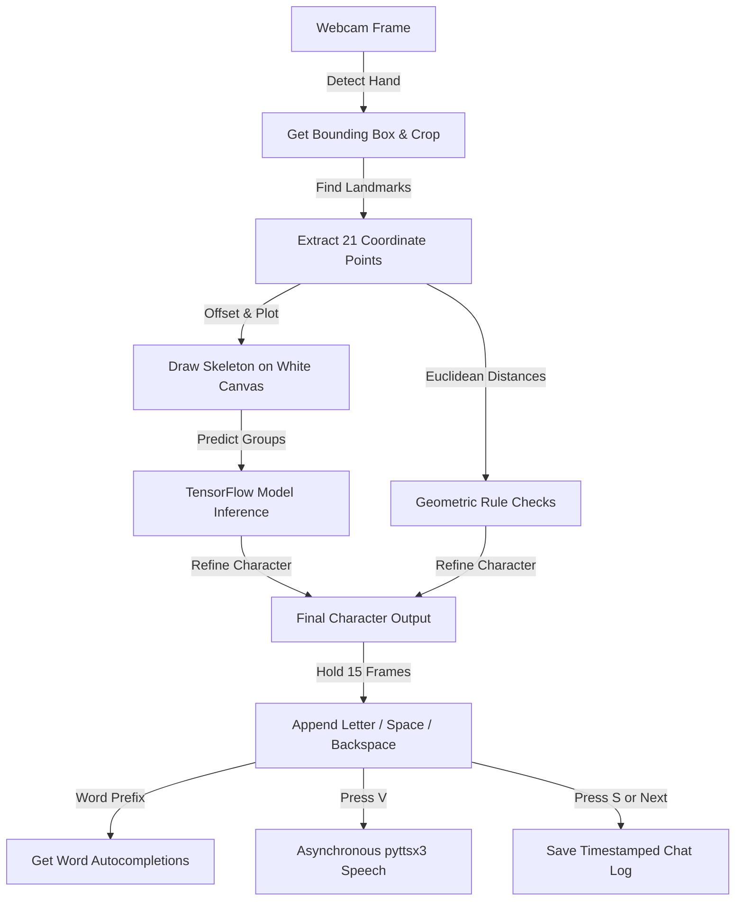

# ✋ Hand Sign Recognition System

**An intelligent, real-time sign language interpreter that translates hand gestures into text and spoken audio.**

---

## 📐 System Architecture

The application runs on a pipeline mapping real-time video frames directly to mathematical and deep-learning classification nodes:



---

## 🌟 Core Features

*   **⚡ Real-Time Gesture Tracking**: Instantly captures hand landmarks and gestures from your webcam feed.
*   **🔮 Noise-Free Skeleton Processing**: Converts hand movements into standardized skeletal vectors, neutralizing differences in skin tone, lighting, and busy backgrounds.
*   **🗣️ Instant Text-to-Speech**: Translates compiled sentences into clear audio using an asynchronous speech engine.
*   **🤖 Smart Word Autocomplete**: Suggests vocabulary completions dynamically based on characters typed, letting you speed up conversation.
*   **💾 Conversation Log Exporter**: Automatically formats and saves your chat sessions into timestamped text files.

---

## 🚀 Get Started in 3 Steps

Get the app running locally on your computer in just a few commands:

### 1. Activate Environment
Open your terminal inside the project directory and run:
```bash
venv\Scripts\activate
```

### 2. Install Dependencies
```bash
pip install -r requirements.txt
```

### 3. Launch App
```bash
python final_prediction.py
```

---

## ⌨️ Control Pad

Interact with the application in real-time using these hotkeys:

| Key | Action |
| :---: | :--- |
| **`ESC`** | Quit application |
| **`C`** | Clear the active sentence |
| **`V`** | Speak the active sentence aloud |
| **`S`** | Save conversation history to a file |
| **`1` - `5`** | Inject word suggestions |

---

## 🛠️ The Tech Blueprint

This system is built using a modern AI and vision stack:
*   **OpenCV** for custom dark-mode split UI panels and video tracking.
*   **MediaPipe** for 21-point hand joint coordination mapping.
*   **Keras/TensorFlow** for high-speed convolutional neural network classification.
*   **pyttsx3** for asynchronous thread-based voice generation.

---

## 👤 Developer

*   **Aditi Arya** ([@Aditea19](https://github.com/Aditea19)) - *UI Design, Landmarks Pipeline, & Text-to-Speech Integration*
